# ROADMAP 90 HARI FRONTEND MOBILE DEVELOPER (EXPO ECOSYSTEM)
## Kurikulum Pelatihan Mandiri Belajar Mobile Frontend dari Nol Hingga Siap Kerja
**Studi Kasus: Sistem Donor Darah PMI (DonorKu) | Integrasi REST API Backend**

---

## 📅 DAFTAR FASE BELAJAR

```mermaid
gantt
    title Peta Jalan Pembelajaran 90 Hari - Expo Mobile Frontend
    dateFormat  D
    axisFormat Day %d
    section Fase 1
    Fondasi React Native, TypeScript & NativeWind   :active, 1, 15d
    section Fase 2
    Expo Router, Layout Navigation & Lifecycle     : 16, 20d
    section Fase 3
    Data Fetching, Zustand & Form Validation       : 36, 20d
    section Fase 4
    Expo Camera, Maps, Location & Native Device     : 56, 20d
    section Fase 5
    Grafik, Notifikasi CITO, EAS Build & Release    : 76, 15d
```

---

## 📂 FASE 1: Fondasi React Native, TypeScript, & NativeWind (Hari 1 s.d 15)
*Fokus: Memahami arsitektur React Native, setup lingkungan Expo SDK terbaru, TypeScript untuk type safety, styling modern menggunakan Tailwind CSS (NativeWind).*

*   **Hari 1**: Pengenalan React Native & Arsitektur Jembatan JavaScript (New Architecture / TurboModules).
*   **Hari 2**: Setup Environment: Node.js, Git, VS Code Extensions, Expo Go App di HP, & EAS CLI.
*   **Hari 3**: Inisialisasi Proyek Baru `npx create-expo-app@latest` menggunakan template TypeScript.
*   **Hari 4**: Struktur Folder Proyek Expo SDK Terbaru (Layout `app/`, `components/`, `hooks/`, `constants/`).
*   **Hari 5**: Dasar JSX & Perbedaan Tag HTML (`div`, `span`, `img`) dengan Komponen React Native (`View`, `Text`, `Image`).
*   **Hari 6**: Pengenalan Styling: StyleSheet React Native & Instalasi **NativeWind v4** (Tailwind CSS untuk Native).
*   **Hari 7**: Layout Flexbox di Android & iOS (Flex Direction, Align Items, Justify Content).
*   **Hari 8**: Input Text & Komponen Tombol (`TextInput`, `Pressable` vs `TouchableOpacity`).
*   **Hari 9**: Komponen Scroll: `ScrollView` untuk layout formulir panjang dan `SafeAreaView` untuk proteksi Notch kamera HP.
*   **Hari 10**: Render List Besar: Komponen `FlatList` untuk memuat jadwal kegiatan donor darah PMI.
*   **Hari 11**: Render List Berkelompok: `SectionList` untuk memisahkan daftar relawan berdasarkan golongan darah.
*   **Hari 12**: Konsep Props: Berbagi data antar komponen UI (`defineProps` versi React Native).
*   **Hari 13**: Konsep State: React `useState` & Reaktivitas lokal (penambahan counter kantong darah).
*   **Hari 14**: Integrasi Fonts: Memasang Google Fonts kustom (Inter/Outfit) menggunakan `expo-font`.
*   **Hari 15**: **Evaluasi Fase 1**: Membuat UI kartu profil relawan PMI Lampung menggunakan NativeWind.

---

## 📂 FASE 2: Expo Router (File-based Routing) & Lifecycle Hooks (Hari 16 s.d 35)
*Fokus: Menguasai routing berbasis file modern (Expo Router v3), navigasi Tabs & Stack, rute dinamis, modal screen, dan siklus hidup komponen React.*

*   **Hari 16**: Pengenalan **Expo Router**: Sistem routing berbasis folder (`app/`) menyerupai Next.js.
*   **Hari 17**: Navigasi Tumpukan (**Stack Navigation**) untuk alur pindah halaman detail.
*   **Hari 18**: Navigasi Tab Bawah (**Tabs Navigation**) untuk menu utama (Beranda, Riwayat, Profil).
*   **Hari 19**: Navigasi Laci (**Drawer Navigation**) untuk menu menu samping admin panel.
*   **Hari 20**: Pindah Rute Terprogram menggunakan helper `router.push()`, `router.replace()`, dan `router.back()`.
*   **Hari 21**: Rute Dinamis (**Dynamic Routes**): Membuat detail donor berdasarkan ID `/donor/[id]`.
*   **Hari 22**: Mengirim dan membaca parameter URL menggunakan hook `useLocalSearchParams()`.
*   **Hari 23**: Custom Layouts: Mengatur desain header bar navigasi kustom berwarna merah khas PMI.
*   **Hari 24**: Menampilkan Layar Pop-up (**Modal Screen**) menggunakan Expo Router Grouping `(modal)/stok`.
*   **Hari 25**: Penanganan Tombol Back Fisik Android menggunakan `BackHandler` API.
*   **Hari 26**: Siklus Hidup Komponen: Penggunaan React Hook `useEffect` untuk inisialisasi awal.
*   **Hari 27**: Hook Siklus Navigasi: Menggunakan `useFocusEffect` untuk memicu refresh data saat halaman aktif dibuka.
*   **Hari 28**: Mencegah Kebocoran Memori (Memory Leak) akibat interval/timeout di mobile.
*   **Hari 29**: Animasi Transisi Halaman bawaan Stack Router.
*   **Hari 30**: Menangani Hydration Mismatch & Kecepatan Rendering Awal di Android Emulator.
*   **Hari 31**: Komponen Mengambang: Pemasangan `Teleport` versi React Native menggunakan Portal Library.
*   **Hari 32**: Custom Hooks dasar untuk memilah logika layar dengan tampilan UI.
*   **Hari 33**: Pengenalan Dark Mode dinamis menggunakan hooks `useColorScheme` dan NativeWind.
*   **Hari 34**: Menangani status koneksi internet HP terputus menggunakan `expo-netinfo`.
*   **Hari 35**: **Evaluasi Fase 2**: Membuat struktur navigasi lengkap portal petugas UDD PMI Lampung.

---

## 📂 FASE 3: Data Fetching, Zustand State, & Form Validation (Hari 36 s.d 55)
*Fokus: Komunikasi API backend, manajemen state global ringan (Zustand), persistence lokal, formulir validasi canggih dengan React Hook Form & Zod.*

*   **Hari 36**: Dasar Otorisasi HTTP: Setup **Axios Instance** dengan baseUrl dan timeout.
*   **Hari 37**: Custom fetcher hook `useApi` untuk React Native.
*   **Hari 38**: Mengatasi Masalah CORS & Konfigurasi alamat IP localhost Android Emulator (`10.0.2.2`).
*   **Hari 39**: Integrasi GET API: Menampilkan daftar stok darah dari database pusat Express.js.
*   **Hari 40**: Fitur Tarik untuk Refresh (**Pull to Refresh**) pada FlatList stok darah.
*   **Hari 41**: Mengelola State Global menggunakan **Zustand** (Alternatif Pinia yang super ringan untuk React).
*   **Hari 42**: Menyusun Auth Store: Menyimpan data login petugas dan token JWT di Zustand.
*   **Hari 43**: Persistensi State: Menyimpan Token secara aman menggunakan **`expo-secure-store`** (Enkripsi KeyStore OS).
*   **Hari 44**: Otorisasi Lintas Rute: Menyuntikkan Token Bearer secara otomatis di Axios Interceptor.
*   **Hari 45**: Mengamankan input: Integrasi **React Hook Form** untuk form pendaftaran relawan.
*   **Hari 46**: Validasi Skema Zod: Mengintegrasikan Zod validator dengan React Hook Form resolver.
*   **Hari 47**: Penanganan error validasi input dan visual warna border merah penanda error.
*   **Hari 48**: Integrasi POST API: Mendaftarkan relawan baru ke database backend PMI Lampung.
*   **Hari 49**: Menampilkan Toast Notifikasi melayang menggunakan library `react-native-toast-message`.
*   **Hari 50**: Desain Loading Loader Spinner & Halaman Transisi.
*   **Hari 51**: Menangani Error Global: Membuat komponen **ErrorBoundary** jika API padam.
*   **Hari 52**: Optimasi Gambar: Lazy Loading & Caching gambar profil relawan menggunakan `expo-image`.
*   **Hari 53**: Mengubah Status Parsial: Integrasi PUT/PATCH API untuk mengubah status kehadiran relawan donor.
*   **Hari 54**: Menyimpan Data Non-Sensitif menggunakan `AsyncStorage` (Alternatif LocalStorage).
*   **Hari 55**: **Evaluasi Fase 3**: Membuat Form Registrasi Pendonor Baru terintegrasi API + Zustand Store.

---

## 📂 FASE 4: Integrasi Fitur Native HP (Location, Camera, Maps) & UX (Hari 56 s.d 75)
*Fokus: Mengakses hardware fisik handphone menggunakan Expo SDK Modules (Geolocator GPS, Kamera, Maps, Galeri Foto).*

*   **Hari 56**: Konsep Route Guard (Proteksi Halaman) menggunakan layout routing di Expo Router.
*   **Hari 57**: Otorisasi Guest Route: Mencegah user login mengakses halaman Login kembali.
*   **Hari 58**: Hak Akses Sistem Operasi (**OS Permissions**): Meminta izin penggunaan GPS dan Kamera HP.
*   **Hari 59**: Mengambil Titik Koordinat GPS petugas menggunakan **`expo-location`**.
*   **Hari 60**: Integrasi Peta: Memasang peta interaktif menggunakan **`react-native-maps`**.
*   **Hari 61**: Menggambar Marker UDD PMI Lampung pada Peta berdasarkan kordinat GPS aktif.
*   **Hari 62**: Kustomisasi Marker Peta dengan logo PMI dan ikon Rumah Sakit Swasta Lampung.
*   **Hari 63**: Membuka Google Maps / Apple Maps eksternal untuk penunjuk arah kurir darah.
*   **Hari 64**: Mengakses Kamera HP petugas menggunakan **`expo-camera`**.
*   **Hari 65**: Mengambil Foto KTP relawan dan menampilkan pratinjau gambarnya di layar.
*   **Hari 66**: Mengambil Gambar dari Galeri HP petugas menggunakan **`expo-image-picker`**.
*   **Hari 67**: Upload File Biner: Membungkus foto menjadi data `FormData` multipart di React Native.
*   **Hari 68**: Integrasi Upload API: Mengirimkan berkas foto KTP ke server backend Express.
*   **Hari 69**: Fitur Pencarian Terdebound (Debounced Search) di sisi server untuk data relawan besar.
*   **Hari 70**: Pemuatan Halaman Otomatis (**Infinite Scroll / Pagination**) pada FlatList relawan.
*   **Hari 71**: Membuat Komponen Skeleton Loader berdenyut untuk visual transisi loading halaman.
*   **Hari 72**: Penanganan Keyboard Pintar menggunakan `KeyboardAvoidingView` agar input tidak tertutup keyboard HP.
*   **Hari 73**: Keamanan Input: Melindungi input teks riwayat medis dari serangan script injeksi XSS.
*   **Hari 74**: Memutar Efek Suara notifikasi CITO masuk menggunakan `expo-av`.
*   **Hari 75**: **Evaluasi Fase 4**: Membuat halaman survei lapangan donor, ambil foto posko, rekam GPS, & upload.

---

## 📂 FASE 5: Visualisasi Grafik, Push Notifications, EAS Build & Deployment (Hari 76 s.d 90)
*Fokus: Pembuatan chart visual, notifikasi darurat CITO, perakitan APK Android / IPA iOS menggunakan Expo Application Services (EAS).*

*   **Hari 76**: Pemasangan Pustaka Grafik: Integrasi **`react-native-gifted-charts`** (sangat responsif di Android/iOS).
*   **Hari 77**: Membuat Diagram Batang (Bar Chart) riwayat jumlah pendonor bulanan.
*   **Hari 78**: Membuat Diagram Donat (Doughnut Chart) persentase kepemilikan golongan darah.
*   **Hari 79**: Menghubungkan API statistik logistik backend ke Chart reaktif.
*   **Hari 80**: Konsep **Push Notifications**: Cara kerja Firebase Cloud Messaging (FCM) & Apple Push.
*   **Hari 81**: Mendaftarkan Device Token & Konfigurasi **`expo-notifications`** di dalam proyek.
*   **Hari 82**: Mengirimkan notifikasi darurat CITO dari backend Express ke HP petugas.
*   **Hari 83**: Menangani Event Klik Notifikasi: Otomatis membuka halaman CITO `/cito` saat notifikasi ditekan.
*   **Hari 84**: Deep Linking: Mengatur alamat domain kustom (contoh: `donorku://cito/101`) agar aplikasi terbuka otomatis via browser.
*   **Hari 85**: Pengenalan **EAS (Expo Application Services)** & Konfigurasi berkas `eas.json`.
*   **Hari 86**: Membuat Akun Expo Developer & Menyiapkan Sertifikat Keamanan Android (Keystore).
*   **Hari 87**: Menjalankan Perintah Kompilasi Cloud: **`eas build --platform android --profile preview`** untuk menghasilkan file **APK**.
*   **Hari 88**: Pengujian Berkas APK hasil build di HP Android fisik petugas lapangan.
*   **Hari 89**: Mempersiapkan Rilis Google Play Store (AAB Bundle) & App Store Connect iOS.
*   **Hari 90**: **Evaluasi Final 90 Hari**: Demo aplikasi utuh terintegrasi Maps, Kamera, Chart, Notifikasi CITO, dan terpasang via berkas APK online.

---

> [!IMPORTANT]
> Seluruh penjelasan materi harian wajib menggunakan perumpamaan analogi kehidupan sehari-hari (layman terms), contoh kasus riil PMI Lampung, kode program lengkap dengan TypeScript, latihan soal mandiri, dan kunci jawaban pembahasan lengkap di bagian bawah setiap dokumen.
